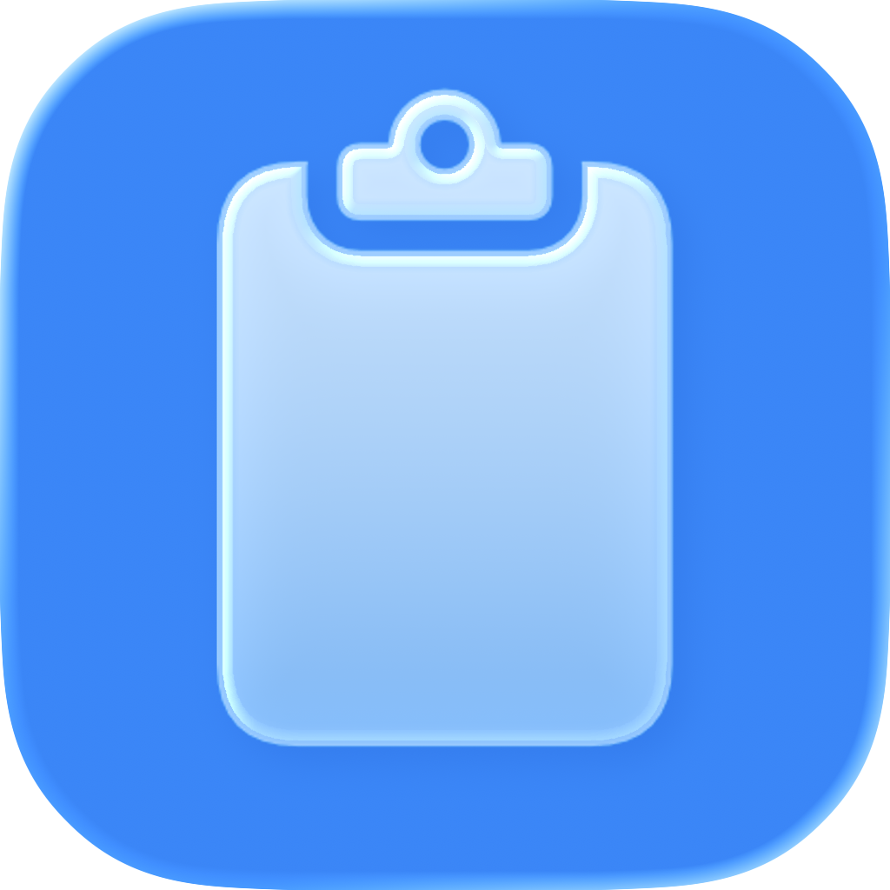
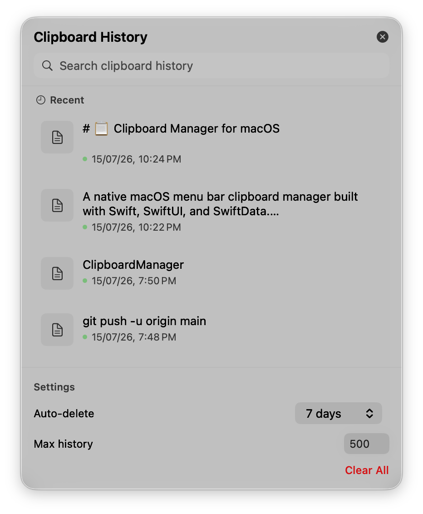
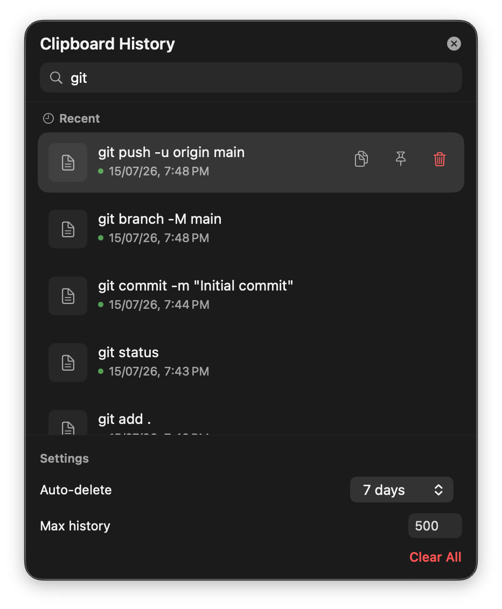

# 📋 Clipboard Manager for macOS

A lightweight, native macOS menu bar clipboard manager built with **Swift** and **SwiftUI**.

I found the default macOS clipboard experience a little frustrating—once you copy something new, the previous item is gone. While there are ways to search for copied content, I found them slow and not well suited for quickly accessing clipboard history.

This project runs quietly in the background and lives in the macOS menu bar, automatically keeping track of everything you copy, including text and images.

---

## 📸 Screenshots

### App Icon



### Clipboard History



### Search



---

## ✨ Features

- 📋 Automatically stores clipboard history
- 📝 Supports text and images
- 🔍 Search clipboard history
- ⚡ Runs in the background
- 🍎 Native SwiftUI interface

## 🚀 Getting Started

### Requirements

* **macOS 26 (Tahoe)** or later
* **Xcode 26** or later

### Run from Source

1. Clone the repository:

```bash
git clone https://github.com/Shrijo7478/ClipboardManager.git
```

2. Open `ClipBoardManager.xcodeproj` in Xcode.

3. Select your Mac as the target device.

4. Press **⌘R** to build and run the application.

5. If prompted, grant the required macOS permissions.

Once launched, the application runs in the background and can be accessed from the macOS menu bar.

### Build the Application

To create a standalone build:

1. In Xcode, go to **Product → Build** (`⌘B`).
2. Once the build completes, open the **Products** folder in the Project Navigator.
3. Right-click **ClipBoardMate.app** and select **Show in Finder**.
4. The built application can then be copied to your **Applications** folder or run directly.
